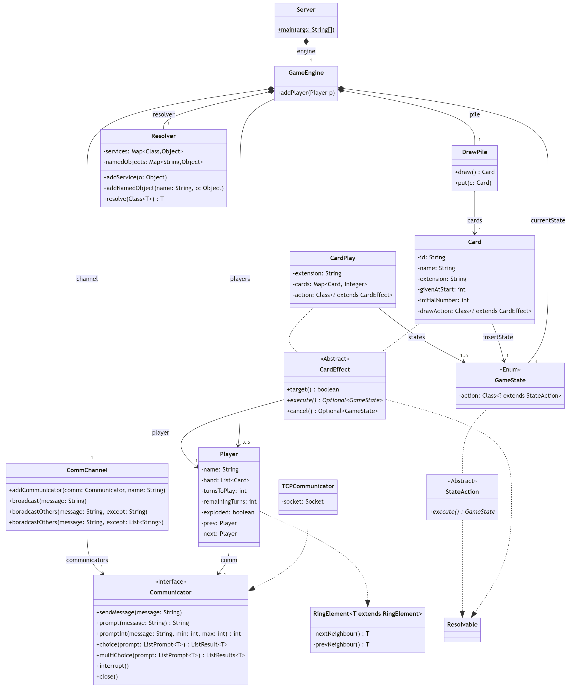
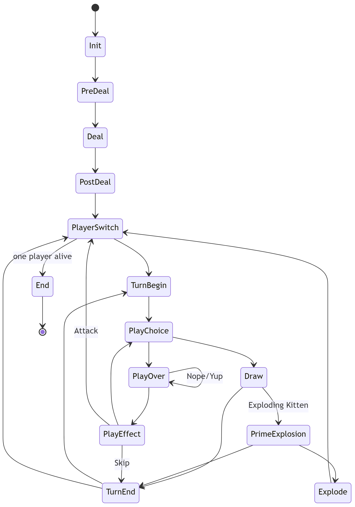
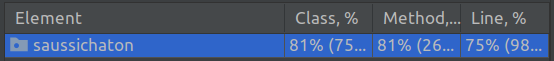

# Software Engineering - Home Exam

## Question 1 - Unit testing (2pts)

> Which requirement(s) (1 to 13) is/are currently not being fulfilled by the code ? For each of the requirements that are not fulfilled :
> 
> - If it is possible to test the requirement using JUnit without modifying the existing code, write what the JUnit assert (or appropriate code for testing it) for it would be.
> - If it is not possible to test the requirement using JUnit without modifying the existing code, motivate why it is not.

Requirement 1 is not met, as it is possible to start a game with 1 player (in which case the player wins after playing the first card), or with 6 players or more. An exception should probably be thrown in those cases, here is how we could test this :

```java
@Test
public void testTooLittlePlayers() {
	assertThrows(IllegalArgumentException.class, () -> new ExplodingKittens(new String[]{"1", "0"}));
}

@Test
public void testTooManyPlayers() {
	assertThrows(IllegalArgumentException.class, () -> new ExplodingKittens(new String[]{"6", "0"}));
}
```

Requirement 3 is not met because the initial number of defuse cards in the deck is equal to $6-n$, with $n$ the number of players (for example, with two players we have 4 cards instead of 2). It is very complicated to test, because the cards are added to the deck in `initGame`, which is immediately going to start the game afterwards, and we won't be able to stop it until a player wins. If we wanted to test that, we would have to start the game in a separate thread, add fake players with a TCP connection and start the game. Then, we should take the number of defuse cards in the deck and in the hands of the players, and check that the amount is correct (`n + (n==5) ? 1 : 2`). Finally, we would have to somehow kill all the threads. Doing this is unrelistically complicated, hence we'll say that testing this aspect of the game is impossible.

Part of requirement 11 is also not respected because it is impossible to play three cards of a kind to steal a specific card from another player due to a bug. For instance, the command `Three Cattermelon 0 Nope` yields `Not a viable option, try again`. This is because the check for a viable command is incorrect, and so it is impossible to trigger it, although the code actually exists. Once again, we would need to start a game with fake players in order to test this, which would be too complicated. 

## Question 2 - Quality attributes, requirements and testability (1pt)

> Why are requirements 17-18 poorly written ? Motivate your answer and what consequences these poorly written requirements will have on development.

These requirement are very general, they do not give an objective metric that could allow us to measure how good our code is. For instance, it states that the code should be "easily" testable (which is subject to interpretation), but it does not give a coverage value. Hence, we could pick any value that seems good enough and argue that it is sufficient. As for the extensibility and modifiablity, it is once again not clear as to what "easily" means. This means we will have to make choices (probably based on our own experiences and/or prefrences), but the final result might not be what the person who wrote the requirements expected.

## Question 3 - Software Architecture and code review (3pts)


> Reflect on and explain why the current code and design is bad from:
> 
> - an Extensibility quality attribute standpoint
> - a Modifiability quality attribute standpoint
> - a Testability quality attribute standpoint
>
> Use terminologies from quality attributes: coupling, cohesion, sufficiency, completeness, primitiveness

### Extensibility

From an extensibility standpoint, it is complicated to work with this code because it is difficult to understand in the first place. Indeed, all the code that does the logic is contained within one class, with numerous imbricated loops (very low primitiveness, very high coupling). Hence, we would have to apply tons of patchworks to implement a new functionality. There are also no reusable components, so it would take a substantial amount of time to implement certain things from scratch.

### Modifiability

It is very difficult to modify this code because of the high coupling and low primitiveness mentioned above. Indeed, there are no generic interfaces nor well-defined constants, so modifying some bit of code might break something else that relies on two hardcoded values being the same. This is also the case because there is low cohesion between the components, for example the fields of the objects are public, so there is no way to ensure which part of the code can or cannot modify them. There are no `final` keywords either, even for variables whose values should never change. 

### Testability

Since all the code that does the logic for the server is located in one function (very bad primitiveness), it is very difficult to test anything as one would have to setup an entire mock scenario each time we want to test a feature. This would be very time consuming thing to do and would not be very accurate nor reliable, since it would test multiple different features at a time. 

## Question 4 - Software Architecture design and refactoring (6pts)

> Consider the requirements (1 to 18) and the existing implementation. Update / redesign the software architecture design for the application. The documentation should be sufficient for a developer to understand how to develop the code, know where functionalities are to be located, understand interfaces, understand relations between classes and modules, and understand communication flow. Use good software architecture design and coding best practices (keeping in mind the quality attributes: coupling, cohesion, sufficiency, completeness, primitiveness).
>
> Also reflect on and motivate:
> 
> - how you are addressing the quality attribute requirements (in requirements 17 – 18 on the previous page). What design choices did you make specifically to meet these quality attribute requirements?
> - the use of design-patterns, if any, in your design. What purpose do these serve and how do they improve your design?

The architecture of the new implementation is described in figure 1.

The core idea is to have states that correspond to actions. The states are the values of the enum `GameState` and the actions are subclasses of `StateAction`. An action returns the next state, and the state has a reference to the class of its action, hence we can chain the states. Figure 2 summarises the states that exist within the game, and their chaining together. This way of chaining states allows to add new states and rewire them quite easily. This also allows to have states with very small amounts of code (high primitiveness).

We also have cards and card plays that are used to hold the "rules" of the game (number of cards, effects, ...). A card play is specifically a set of cards that can be played at one or several states of the game. Both of these objects can be loaded from a JSON configuration file in the JAR, so it is relatively easy to add new ones. They also belong to an extension, which will be convenient if we want to implement extensions in the future, allowing to enable or disable some extensions. Currently, all cards and card plays belong to the `base` extension, which is always loaded.

A `CardPlay` has a `CardEffect`, which is another type of generic object (kind of like the `StateAction`). This time, it does not always yield a `GameState`, we use the `Optional` to indicate that the return value is not always there (this is a sort of evolution of the null object design pattern). The idea is that a `CardEffect` can modify the normal flow of the game, but it only does so if it is necessary, else the `StateAction` that calls it provides a default value. This is notably what happens at the `PlayEffect` state, where a Skip card or an Attack card can jump directly to the `PlayerSwitch` or `TurnEnd` without going through `PlayChoice` and `Draw`.

A `Card` can also have a `CardEffect`. If so, it will be executed right after the card is drawn from the draw pile. This enables for example to enter in the `PrimeExplosion` state after drawing an Exploding Kitten, and could also be useful for some extensions, such as Imploding Kittens for example (with the Imploding Kitten card).

Now, we have references to subclasses of `StateAction` and `CardEffect`, but there is still the problem of instantiating them and giving them the data they need. Ideally, we would like to give them only the data they need, without them needing to make tons of getter calls. This could be seen as a form of completeness/sufficiency : we want all the necessary data but only that. Having tons of static objects seems like an obvious solution, but it is generally not a very good way to proceed. This is why I decided to work with the dependency injection design pattern, which also has the advantage of providing very weak coupling. The idea is that we have a `Resolver` object that take classes implementing the `Resolvable` interface. This interface does not have any functions, it is only here to say that we are sure that the objects implementing the interface have constructors that can be injected. The `Resolver` has two kind of objects : services which are identified by their class, and named object that are identified by their name. For all the arguments of a constructor, it will try to find a service of the same type. If it doesn't have one, it will search for a named object with the same name as the argument. It will then use all of these objects to call the constructor via the introspection API provided by Java. 

For communication, we have the generic `Communicator` interface that is used to send messages or prompt the users for values and get responses. Currently, there is an implementation with TCP, but it could easily be changed as long as we implement the interface. The only thing that needs to change is the `Server` that accepts the connections and creates the communicators. The values returned by the `Communicator` are considered sane, it is up to the implementation to check the values it receives. Another advantage of this interface is that it could easily enable the creation of bots, with a different implementation that doesn't actually communicate on the network. Note that this would probably require to change the interface to add identifiers to the prompts in order to differentiate them programatically, but it wouldn't be too complicated in the current state of the program.

The `Communicator` is also very useful for testing because we can once again create an implementation that doesn't use the network, but yields predefined values in order to execute a test scenario. On the topic of testing, the fact that we used dependency injection for the state actions and card effects is also very convenient because it allows us to control the inputs during the tests. 

Finally, on the topic of design patterns, we can notice that we use the composite design pattern for the players (or some derivated form). The player are chained together in a strcture that I called a "ring", which is kind of like a chained list where the end is linked to the beginning. This allows to iterate conveniently over the players, exactly as if they were sitting around a table, without ever using indexes. The composite design pattern is also used in a class not represented on the diagram to index the card plays efficiently and conveniently.





## Question 5 - Quality Attributes, Design Patterns, Documentation, Re-engineering, Testing (13pts)

> Refactor the code so that it matches the design in question 4 (you may want to iterate question 4 once you have completed your refactoring to make sure the design documentation is up to date). The refactored code should adhere to the requirements (1 to 18). Things that are likely to change in the future, divided into quality attributes, are:
> 
> - Extensibility: Additional game-modes, such as those described in the “Future modifications to the game” may be introduced in the future.
> - Modifiability: The way network functionality is currently handled may be changed in the future. Network features in the future may be designed to make the server-client solution more flexible and robust, as well as easier to understand and work with. In addition, the potential expansions (requirement 14) adds new types of card interactions for both new and existing cards, which will change how some operations are handled.
> - Testability: In the future when changes are made to both implementation, game rules, and game modes of the game, it is important to have established a test suite and perhaps even coding guidelines to make sure that future changes can be properly tested.

Full code available at [https://github.com/NathanPERIER/saussichaton](https://github.com/NathanPERIER/saussichaton) (only after the project deadline).




